[portfolio](https://ghaith-zaza.vercel.app/) &nbsp;·&nbsp;
[linkedin](https://www.linkedin.com/in/ghaith-zaza/) &nbsp;·&nbsp;
[email](mailto:ghaith.zaza@outlook.com)

> AI engineer in Dubai. Computer and Systems Engineering, then all the way into AI. 
> Autonomy is the easy half. Being trusted in production is the other one.

I build agentic systems: planners that decide what to do next, retrieval that gives 
them something true to work from, and evaluators that stop the bad runs before 
anyone sees them. Most of what I ship is the unglamorous part — the retries, the 
guardrails, the tracing you need at 2am.

**independent ai engineer** &nbsp;·&nbsp; <samp>dubai — oct 2024 to now</samp> 
Agentic pipelines, multi-modal AI, and the DevOps to keep them up. Voice sales 
agents on ElevenLabs, a BOQ compliance agent that writes quotations from project 
specs, a multi-layered threat detection service on FastAPI and Hugging Face, and a 
fine-tuned BERT filter enforcing compliance on generated output.

**ai engineer** &nbsp;·&nbsp; <samp>innobayt, dubai — feb to may 2025</samp> 
Flight booking assistant with function calling and live seat recommendations, a 
multi-bot agentic API with context retention, and a products quotation agent.

**ai/ml intern** &nbsp;·&nbsp; <samp>impact organization, cairo — 2023</samp> 
NLP and LLM research at Zewail City, built into real applications.

**automation intern** &nbsp;·&nbsp; <samp>smc group, cairo — 2021</samp> 
Automation pipelines for internal workflows, Pytest suites, model interfaces.

**[NashrIQ](https://ghaith-zaza.vercel.app/projects/social-media-orchestrator)** &nbsp;·&nbsp; <samp>fastapi, next.js 15, postgres, apscheduler, ffmpeg</samp> 
An autonomous content team. Give it a niche keyword and a posting schedule; it does 
trend research, writes the script, renders an AI avatar video, and publishes across 
platforms — unattended, on a cron. A Hook Engine generates multiple angles per idea 
and explains why each one lands; a Script Evaluation Engine scores and refines 
before anything reaches production. 22 ms average API response on Neon and Railway.

**[TradeIQ](https://ghaith-zaza.vercel.app/projects/trade-assistant)** &nbsp;·&nbsp; <samp>chronos-bolt, cryptobert, claude, timescaledb, docker</samp> 
A crypto advisor that grades its own homework. Forecasts prices with a locally 
fine-tuned time-series model, reasons about the market with Claude, then scores 
itself against what actually happened. A weekly loop fine-tunes a challenger, 
backtests it against the incumbent on identical cutoffs, and promotes it only if it 
wins. 82–85% prompt cache hit rate.

**[RaselIQ](https://ghaith-zaza.vercel.app/projects/real-estate-sales-agent)** &nbsp;·&nbsp; <samp>langgraph, fastapi, whatsapp cloud api, twilio, elevenlabs</samp> 
An AI coordinator that contacts real estate leads over WhatsApp or voice, qualifies 
them through natural conversation against custom criteria, and escalates the warm 
ones to a human. Multi-tenant, with real-time CRM sync and full pipeline visibility.

**[Velyana](https://ghaith-zaza.vercel.app/projects/velyana)** &nbsp;·&nbsp; <samp>langchain, next.js, supabase</samp> 
Decomposes a complex request into coordinated tasks and hands each to a specialist 
agent.

**[enterprise chatbot deployment engine](https://ghaith-zaza.vercel.app/projects/chatbot-deployment-engine)** &nbsp;·&nbsp; <samp>flask, langchain, pgvector</samp> 
Point it at your URLs and get a chatbot. Scrapes, chunks, embeds, answers through a 
re-ranked RAG pipeline. Multi-tenant with hard Bot ID isolation and a one-line 
embed snippet.

These are client and product work, so the source is private. The 
[portfolio](https://ghaith-zaza.vercel.app/) has the full writeups.

Every agent I've shipped has this shape. The interesting edge is the one pointing 
backwards: an evaluator that can reject its own planner's work is the difference 
between a demo and something you can leave running. Fan the workers out, judge the 
result, send it round again if it isn't good enough.

The contribution graphs count all of my activity. The language chart doesn't — it 
can only see public repositories, which are old coursework and Kaggle notebooks. 
Everything I'd actually want to be judged on is private, and none of it is in 
those bars.
